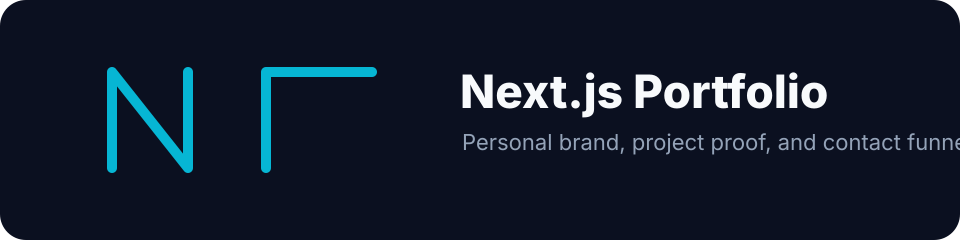
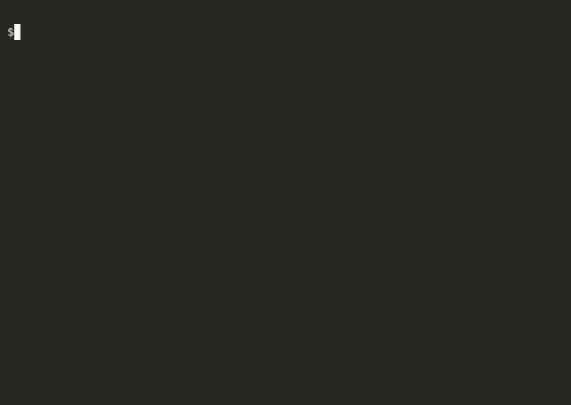

# Portfolio — Gerard Recinto






> Personal portfolio for a Senior Platform / CI/CD Engineer with 8 years at Qualcomm. Built with Next.js 14 App Router, TypeScript, Tailwind CSS, and Framer Motion. Deployed to AWS S3 + CloudFront for global edge delivery.

Commercial angle and funnel notes: [docs/go-to-market.md](docs/go-to-market.md).

## Features

- **Spotlight effect:** Three layered `<Spotlight>` components (white, purple, blue) using `radial-gradient` masks to create a dynamic depth-of-field background — no canvas, no WebGL.
- **Text generate effect:** `TextGenerateEffect` splits the heading string by word, renders each word as a Framer Motion span, and staggers opacity + blur from 0 → 1 on mount via `useEffect` + `useAnimate`.
- **Magic button:** `MagicButton` wraps a button with a conic-gradient animated border (`@keyframes spin`) using a `::before` pseudo-element — pure CSS, no JS animation overhead.
- **Dark/light theming:** `next-themes` `ThemeProvider` with system-default detection; theme toggle persists across sessions via `localStorage`.
- **App Router layout:** Single root `layout.tsx` injects `GeistSans` and `GeistMono` fonts via `next/font/google` — zero layout shift, no FOUT.
- **Static export:** Fully pre-rendered at build time (`output: 'export'`), served as static HTML/CSS/JS — no Node.js process at runtime.

## Tech Stack

| Layer | Technology |
|---|---|
| Framework | Next.js 14 (App Router, static export) |
| Language | TypeScript 5 (strict mode) |
| Styling | Tailwind CSS 3 + `tailwindcss-animate` |
| Animation | Framer Motion 10 (`useAnimate`, `motion.span`) |
| Icons | `react-icons` (FA set) |
| Theming | `next-themes` |
| Hosting | AWS S3 (static website) + CloudFront CDN |

## Architecture

The app is a single-page static export. `app/page.tsx` composes the `Hero` section; additional sections (`About`, `Projects`, `Contact`) are linked from the Hero CTA and scroll into view via `href="#section-id"`. All animation components are client components (`"use client"`) that mount after hydration — the server sends pre-rendered HTML so LCP is instant.

## Component Notes

**`Spotlight`** — absolutely positioned `<div>` with a radial gradient controlled by `className` for position and `fill` for color. Three instances stack with different hue and position to create the layered lighting effect.

**`TextGenerateEffect`** — splits the input string on whitespace, maps each word to a `motion.span` with `initial={{ opacity: 0, filter: 'blur(10px)' }}` and `animate={{ opacity: 1, filter: 'blur(0)' }}`, delayed by word index × 0.1s.

**`MagicButton`** — `position: relative` container with `::before` set to `background: conic-gradient(...)`, rotating via `@keyframes spin 2s linear infinite`. The inner button clips to the container shape via `overflow: hidden`.

## Project Structure

```
app/
├── layout.tsx       root layout: GeistSans/Mono fonts, ThemeProvider, globals.css
├── page.tsx         landing page — composes Hero
└── provider.tsx     "use client" ThemeProvider wrapper

components/
├── Hero.tsx         above-the-fold: Spotlights + TextGenerateEffect + MagicButton
└── ui/
    ├── MagicButton.tsx        animated border button (conic-gradient CSS)
    ├── Spotlight.tsx          radial gradient spotlight overlay
    └── TextGenerateEffect.tsx word-by-word Framer Motion reveal

public/             static assets
utils/              shared utility functions (cn, etc.)
```

## Running Locally

```bash
git clone https://github.com/gerardrecinto/nextjs-portfolio.git
cd nextjs-portfolio
npm install
npm run dev        # http://localhost:3000
```

## Building for Production

```bash
npm run build      # generates static output in /out
npm start          # preview the static export locally
```

## Deployment

`next build` generates a fully static `/out` directory. That directory is synced to an S3 bucket configured for website hosting, fronted by a CloudFront distribution with:
- HTTPS via ACM certificate
- `index.html` as the default root object
- Cache behaviors set to forward `Accept-Encoding` for Brotli/Gzip compression
- CloudFront invalidation on every deploy to purge stale edge cache
