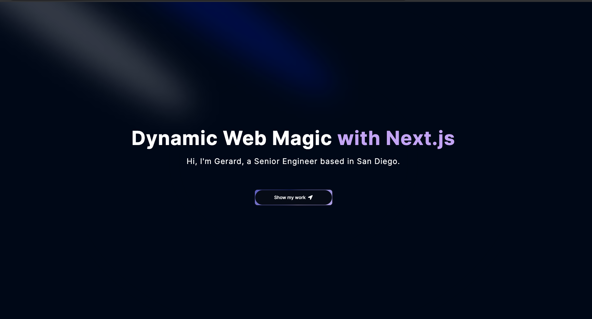

# Portfolio — Gerard Recinto\n\nPersonal portfolio site for a Senior DevOps / Platform Engineer with 8 years of experience. Built with Next.js 14 App Router, TypeScript, and Tailwind CSS.\n\n\n\n## Tech stack\n\n| Layer | Choice |\n|---|---|\n| Framework | Next.js 14 (App Router) |\n| Language | TypeScript |\n| Styling | Tailwind CSS |\n| Components | Hero UI |\n| Runtime | Node.js 20 |\n\n## Structure\n\n```\napp/\n├── layout.tsx       root layout with font config and theme provider\n├── page.tsx         landing page — renders Hero section\n└── provider.tsx     client-side theme context (dark/light)\n\ncomponents/\n├── Hero.tsx         above-the-fold section with intro and links\n└── ui/              shared UI primitives\n```\n\n## Running locally\n\n```bash\nnpm install\nnpm run dev\n```\n\nOpen [http://localhost:3000](http://localhost:3000).\n\n## Building for production\n\n```bash\nnpm run build\nnpm start\n```\n